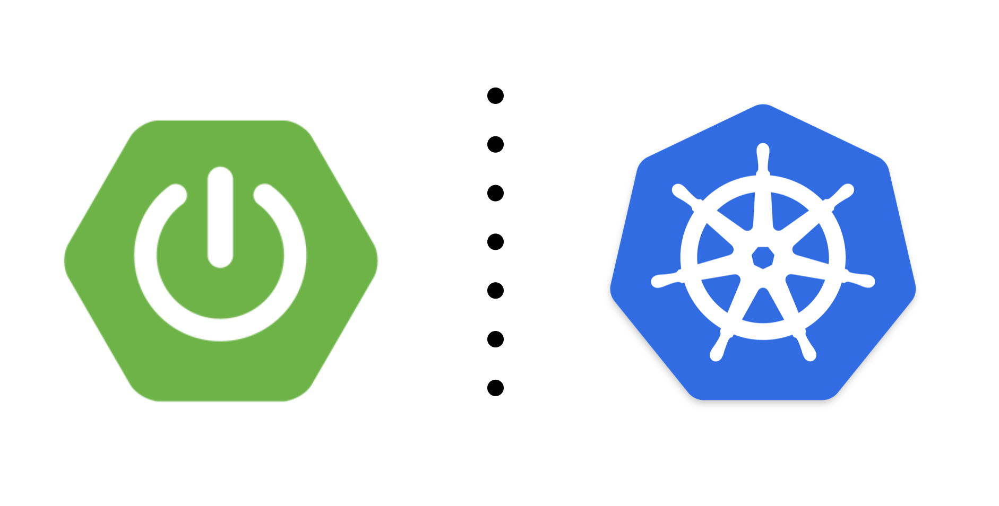
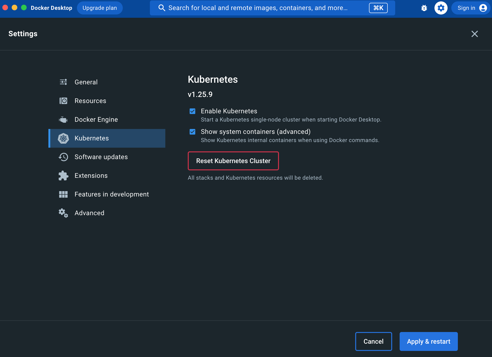
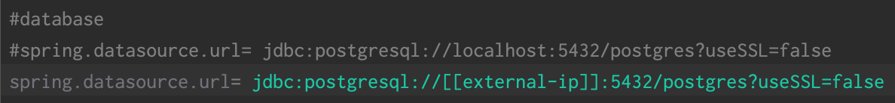
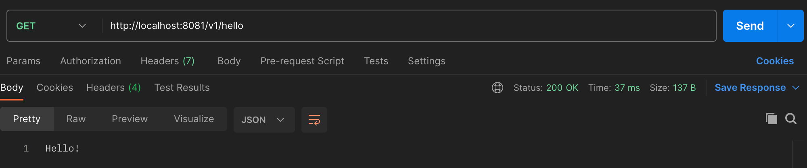
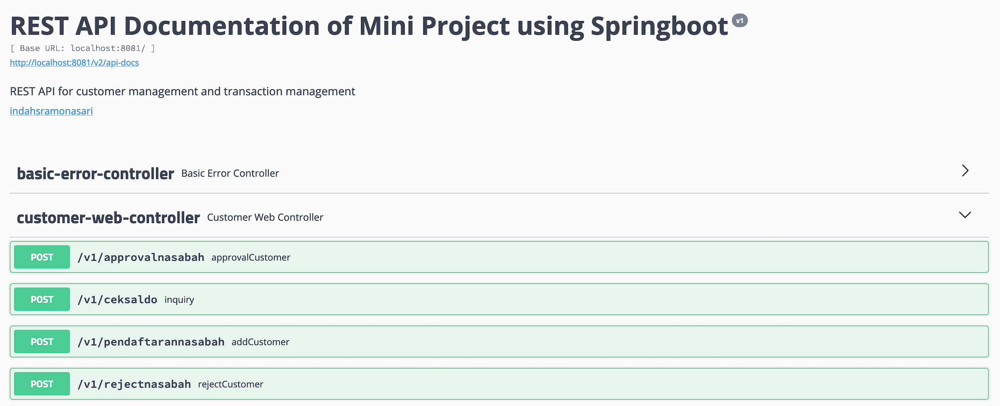

# Learning Kubernetes
**Spring Boot App with Kubernetes Deployment**



## Overview
This project implements JUnit for unit testing (automated tests), swagger for api documentation, docker and kubernetes for deployment.

**Kubernetes**

Kubernetes is an open-source system for automating deployment, scaling, and management of containerized applications.
Containers are a good way to bundle and run your applications. In a production environment, you need to manage the containers that run the applications and ensure that there is no downtime.
Kubernetes provides you with a framework to run distributed systems resiliently. It takes care of scaling and failover for your application, provides deployment patterns, and more.
Kubernetes also provides several features that make deployment easier, including;
- Automated rollouts and rollbacks
- Storage orchestration
- Secret and configuration management 
- Service discovery and load balancing
- Self-healing
- Designed for extensibility

**Docker**

Docker is a software platform that allows you to build, test, and deploy applications quickly. Docker enables an entirely isolated application to be deployed to multiple servers.
We need to install Docker Desktop, follow this link to [Install Docker Desktop](https://www.docker.com/products/docker-desktop/).
Why do we need Docker Desktop? Docker Desktop is the easiest way to run Kubernetes on local machine, it gives you a fully certified Kubernetes cluster and manages all the components for you.
Kubernetes can be enabled from the Kubernetes settings panel as shown below.



Go to Settings, checking the Enable Kubernetes box and then pressing Apply & Restart triggers the installation of a single-node Kubernetes cluster.
To check the kubernetes cluster already installed on your computer, open terminal and run this command:
```<language>
kubectl cluster-info
kubectl get nodes
```

## Deploy the App with Kubernetes Cluster
**Deploy PostgreSQL with Kubernetes**

Create postgres-config.yaml (config for PostgreSQL)
```<language>
apiVersion: v1
kind: ConfigMap
metadata:
  name: postgres-config
  labels:
    app: customer-management-db
data:
  POSTGRES_DB: postgres
  POSTGRES_USER: postgresqldb
  POSTGRES_PASSWORD: postgre123
```
Apply the configuration
```<language>
kubectl apply -f postgres-config.yaml
```
Confirm the configmap
```<language>
kubectl get configmap
```
Create postgres-pvc-pv.yaml (for persistent storage volume and persistent volume claim)
```<language>
kind: PersistentVolume
apiVersion: v1
metadata:
  name: postgres-pv-volume  # Sets persistent volume's name
  labels:
    type: local  # Sets persistent volume's type to local
    app: postgres
spec:
  storageClassName: manual
  capacity:
    storage: 5Gi # Sets persistent volume
  accessModes:
    - ReadWriteMany
  hostPath:
    path: "/mnt/data"
---
kind: PersistentVolumeClaim
apiVersion: v1
metadata:
  name: postgres-pv-claim  # Sets name of persistent volume
  labels:
    app: customer-management-db
spec:
  storageClassName: manual
  accessModes:
    - ReadWriteMany  # Sets read and write access
  resources:
    requests:
      storage: 5Gi  # Sets volume size
```
Create and apply persistent storage volume and persistent volume claim
```<language>
kubectl apply -f postgres-pvc-pv.yaml
```
Check the pvc is bound
```<language>
kubectl get pvc
```
Create postgres-deployment.yaml (for deployment)
```<language>
apiVersion: apps/v1
kind: Deployment
metadata:
  name: customer-management-db  # Sets Deployment name
spec:
  replicas: 1
  selector:
    matchLabels:
      app: customer-management-db
  template:
    metadata:
      labels:
        app: customer-management-db
    spec:
      containers:
        - name: customer-management-db
          image: postgres:10.1 # Sets Image
          imagePullPolicy: "IfNotPresent"
          ports:
            - containerPort: 5432  # Exposes container port
          envFrom:
            - configMapRef:
                name: postgres-config
          volumeMounts:
            - mountPath: /var/lib/postgresql/data
              name: postgres
      volumes:
        - name: postgres
          persistentVolumeClaim:
            claimName: postgres-pv-claim
```
Check if your deployments and the children objects, such as pods, are created successfully
```<language>
kubectl apply -f postgres-deployment.yaml
```
Create postgres-service.yaml (for expose ports in various ways)
```<language>
apiVersion: v1
kind: Service
metadata:
  name: customer-management-db # Sets service name
  labels:
    app: customer-management-db # Labels and Selectors
spec:
  type: NodePort # Sets service type
  ports:
    - port: 5432 # Sets port to run the postgres application
  selector:
    app: customer-management-db
```
Create and apply ports
```<language>
kubectl apply -f postgres-service.yaml
```
Check all objects
```<language>
kubectl get all
```
Connect to database, modify database (create schema, tabel, insert data)
```<language>
kubectl exec -it [pod-name] --  psql -h localhost -U admin --password -p 5432 postgresdb
```

**Database Configuration of This Project**

Create a new role
```<language>
database name = postgres
username = postgresqldb
password = postgre123
```
Run the DDL command to create a new table
```<language>
CREATE TABLE customer(
nik varchar(20) primary key,
full_name varchar(50),
address varchar(150),
phone_number varchar(12),
account_number varchar(12),
balance numeric,
status varchar(10)
);
```

**Deploy Spring Boot App with Kubernetes**
Show list of deployment services, cluster ip and external ip
```<language>
kubectl get services customer-management-service
```
Change spring.datasource.url into cluster ip of the database on application.properties


Build .jar file of the project
```<language>
mvn clean install
```
Build docker images. We need docker images to deploy with kubernetes cluster.
```<language>
docker build --tag=customer-management-service:latest .
```
Create springboot-deploy.yaml (all configuration, images and port to expose)
```<language>
apiVersion: v1 # Kubernetes API version
kind: Service # Kubernetes resource kind we are creating
metadata: # Metadata of the resource kind we are creating
  name: customer-management-service
spec:
  selector:
    app: customer-management-service
  ports:
    - protocol: "TCP"
      port: 8081 # The port that the service is running on in the cluster
      targetPort: 8081 # The port exposed by the service
  type: LoadBalancer # type of the service. LoadBalancer indicates that our service will be external.
---
apiVersion: apps/v1
kind: Deployment # Kubernetes resource kind we are creating
metadata:
  name: customer-management-service
spec:
  selector:
    matchLabels:
      app: customer-management-service
  replicas: 2 # Number of replicas that will be created for this deployment
  template:
    metadata:
      labels:
        app: customer-management-service
    spec:
      containers:
        - name: customer-management-service
          image: customer-management-service # Image that will be used to containers in the cluster
          imagePullPolicy: IfNotPresent
          ports:
            - containerPort: 8081 # The port that the container is running on in the cluster
```
Create and apply configuration, deploy the service
```<language>
kubectl apply -f springboot-deploy.yaml
```

Show port and pod
```<language>
kubectl get pod -o wide
```
Show logs
```<language>
kubectl logs -f [pod-name]
```
Rollout deployment and restart
```<language>
kubectl rollout restart deployment [service-name] -n default
```

**Path URL**

```<language>
http://localhost:8081/
```
Testing api using Postman



**API Documentation**

```<language>
http://localhost:8081/swagger-ui.html#/customer-web-controller
```


---------------
References :
- [How Kubernetes works under the hood with Docker Desktop](https://www.docker.com/blog/how-kubernetes-works-under-the-hood-with-docker-desktop/)
- [Kubernetes Cheat Sheet](https://kubernetes.io/docs/reference/kubectl/cheatsheet/#kubectl-context-and-configuration)
- [Deploying Microservices on Kubernetes](https://medium.com/aspnetrun/deploying-microservices-on-kubernetes-35296d369fdb)